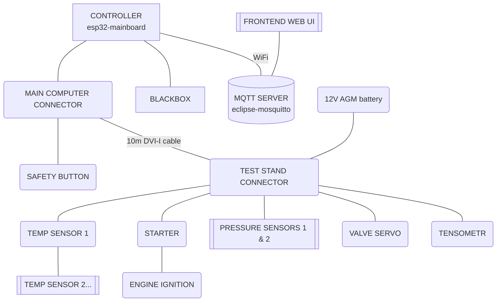

Rakieta hardware
================

This repository contains the hardware and firmware for the rocket engine test project. It groups several PCBs and related firmware used for sensing, control distribution, ignition, and a crash-survivable blackbox recorder.

Subprojects

- `blackbox/`: Blackbox PCB (stores UART data to SD card)
- `blackbox-firmware/`: Firmware for the blackbox recorder
- `connector-main-computer/`: Connector board near controller that aggregates GPIO to a 10m DVI-I cable
- `connector-test-stand/`: Connector board at the test-stand end; decomposes signals, provides power, analog preprocessing, and actuators
- `frontend/`: Web UI for telemetry visualization and command/control; connects to MQTT over WebSocket
- `sensor-tmp107/`: TMP107 temperature sensor PCB (chainable via SMAART wire bus)
- `starter/`: Ignition starter board with I2C IO expander and safety comparator

Connection graph (Mermaid)

MQTT communication

- Broker: Mosquitto (`docker-compose.yml` service `mqtt`)
- Controller (`esp32-mainboard`) publishes telemetry and receives command topics via MQTT
- Frontend connects to the same broker via WebSocket (`ws://<host>:8000`) and subscribes/publishes control topics
- MQTT TCP port: `1883` (standard MQTT)
- MQTT WebSocket port: `8000` (used by frontend)

Notes

- This repo is intended for hardware files (KiCad projects), gerbers and firmware sources related to the test-stand and engine instrumentation.
- See subdirectory READMEs for purpose and quick pointers to major files.
