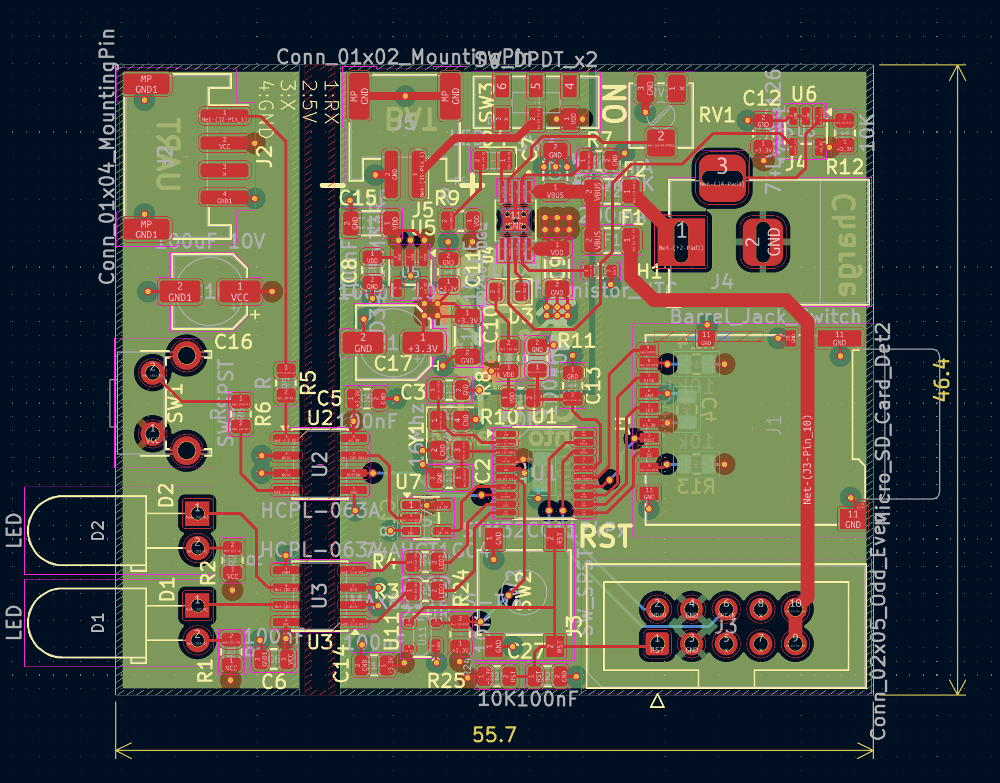

Blackbox PCB
============

Purpose

The `blackbox` board is a crash-survivable data logger. It receives UART data from the controller and writes received data to an SD card so launch telemetry can be retrieved after a failure.

