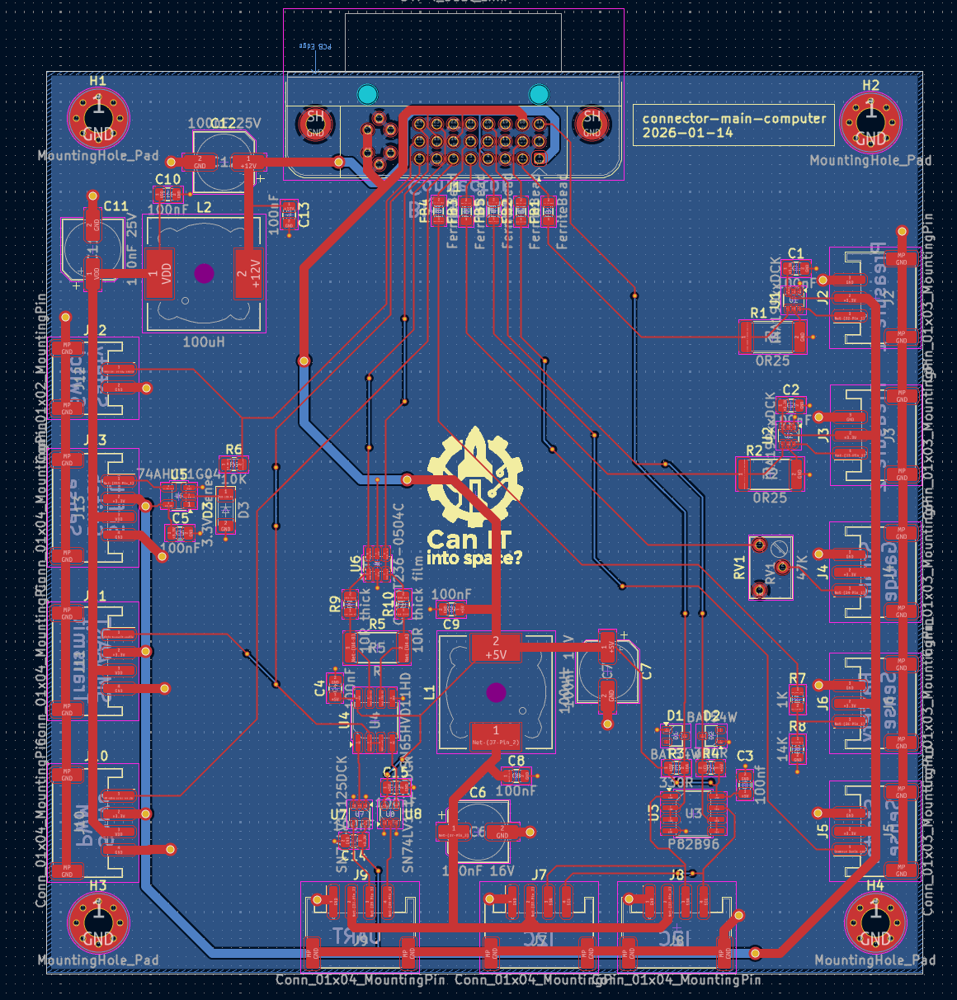

Connector - main computer
=========================

Purpose

This board aggregates the controller's GPIO and signals into a single 10 m DVI-I cable. It is located near the controller to keep the fragile controller away from the engine and high-risk area.

