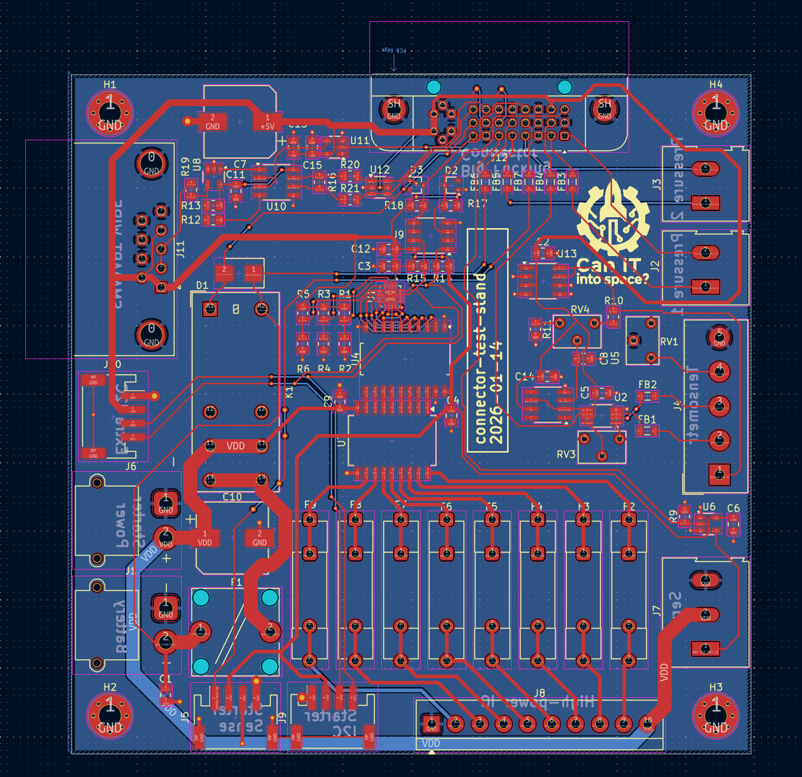

Connector - test stand
======================

Purpose

This board is the test-stand end of the 10 m DVI-I cable. It decomposes the aggregated parallel bus into individual sensor and effector connectors, performs early analog preprocessing, provides power distribution, and drives actuators such as the valve servo.

