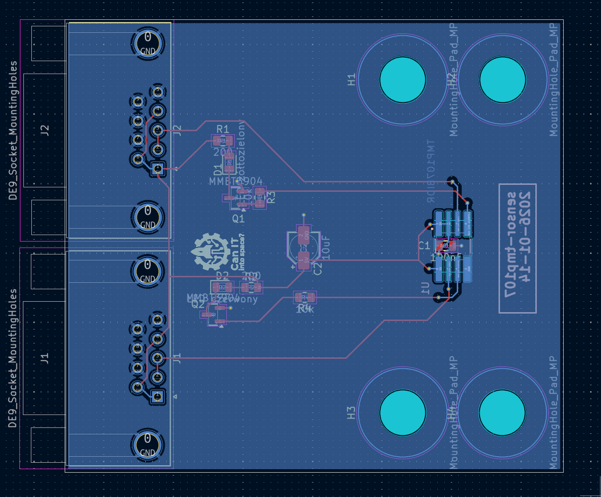

TMP107 temperature sensor board
================================

Purpose

This board implements a temperature sensor using the TMP107 device. Multiple boards can be chained in series using the Ti SMAART wire bus (a UART half-duplex bus) to provide temperature sensing along the test-stand.

