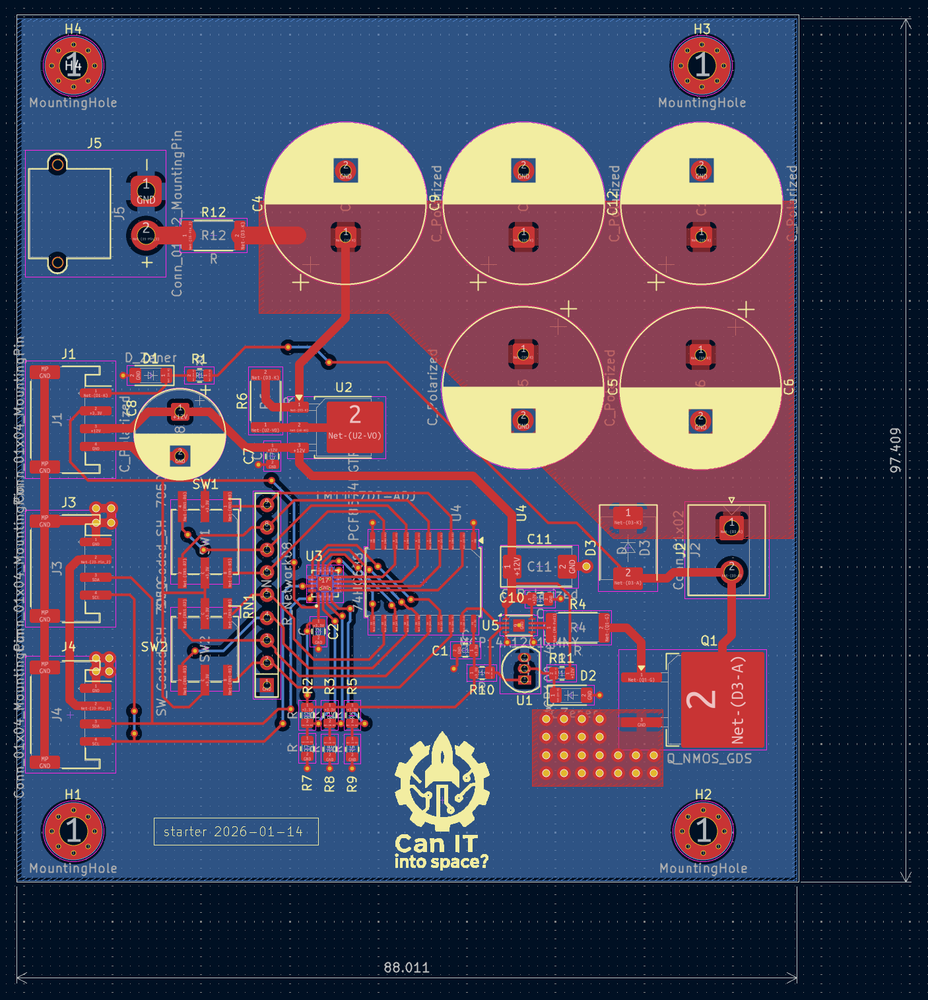

Starter board
=============

Purpose

The `starter` board provides the ignition impulse to fire the engine. It includes an I2C IO expander and an 8-channel digital comparator to require a correct safety byte/address to be present before firing. The rocket engine is fired by discharging a large battery of capacitors via a high power mosfet.

Features

- Safety: ignition only occurs when the correct I2C address/byte is presented to the IO expander. The sent byte is later compared with fixed value that can be set by encoders on PCB.
- Igniter presence sensing (so an ignition attempt can be inhibited if no igniter detected)

